<p align="center">
  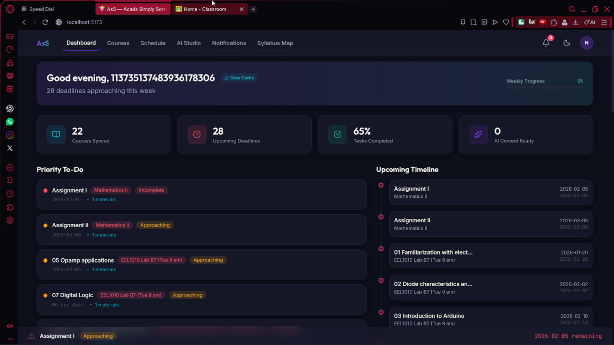
</p>

# 🎓 AsS — Acads Simply Sorted

> **Your AI-powered academic companion** that syncs with Google Classroom, auto-generates animated video lessons from your PDFs, builds smart study schedules, and cross-references your syllabus — all in one sleek dark-mode dashboard.

[](https://drive.google.com/file/d/1DO9nReAzFtdv1fLHhs7FJE6fKSw4Hx9y/view?usp=sharing)
[](https://drive.google.com/file/d/1a1qHBmQ5d6ntmT41fWBN5dvgia490UhJ/view?usp=sharing)

---

## ✨ Features at a Glance

| Feature | Description |
|---|---|
| **📊 Dashboard** | Live stats (courses synced, upcoming deadlines, tasks completed), priority to-do list sorted by urgency, and an upcoming timeline |
| **📚 Courses** | One-click Google Classroom sync, browse all courses, view materials & assignments, selectively "Add to AsS" for on-demand vectorization |
| **📅 Smart Schedule** | Auto-generates an optimized weekly study plan from real deadlines — blocks class hours (8AM–6PM) and sleep (11PM–6AM) |
| **🎬 AI Studio** | Select a PDF → auto-extract summary → generate animated video lessons with Manim & Remotion + AI voiceover |
| **🔍 Syllabus Mapper** | Deep Search & Context — vector-search your entire course library for specific concepts with relevance scores |
| **🔔 Notifications** | Urgency escalation timeline, notification history, and configurable alert preferences |

---

## 📸 Screenshots

### Dashboard
> Live overview with synced courses, upcoming deadlines, and a priority to-do list.


---

### Courses — Google Classroom Sync
> Connect to Google Classroom, browse all your courses, and selectively add materials to your knowledge library.

<p>
  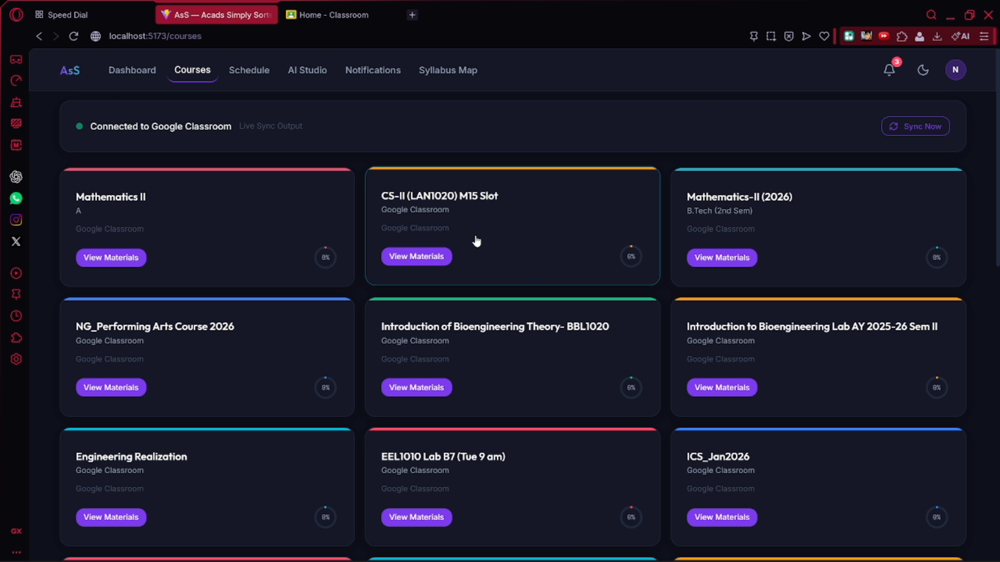
  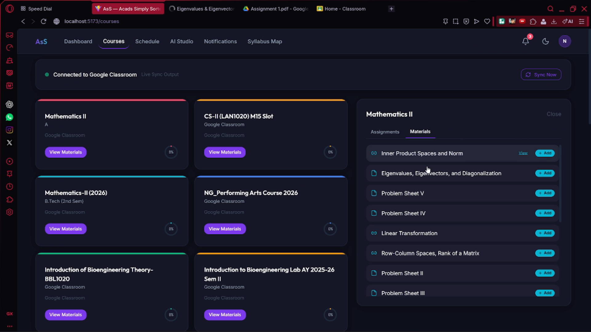
</p>

---

### Smart Schedule
> Dynamically generated weekly study plan based on real assignment deadlines. Respects class hours and sleep time.

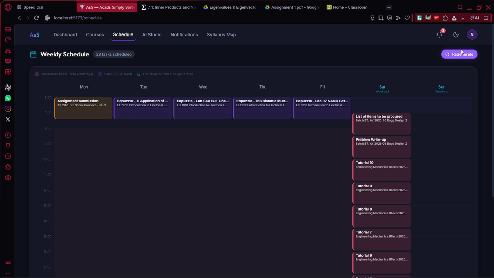

---

### AI Studio — Video Generation
> Select a PDF, auto-populate its summary, and generate animated educational videos with a 5-step pipeline (Plan → Animate → Voice → Render → Finalize).

<p>
  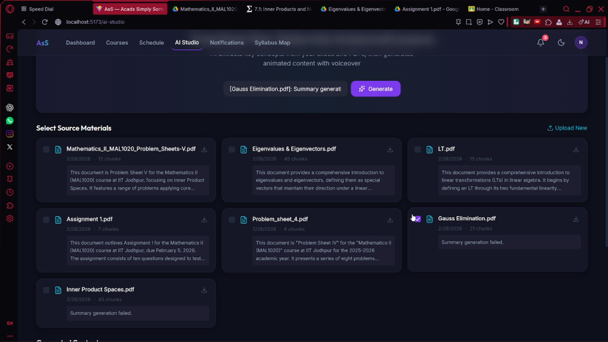
  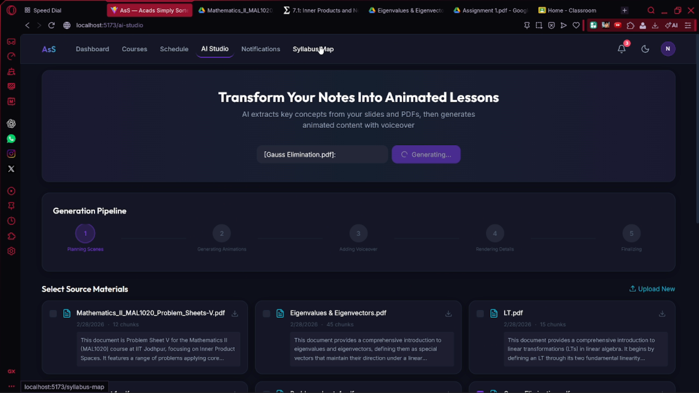
</p>

<p>
  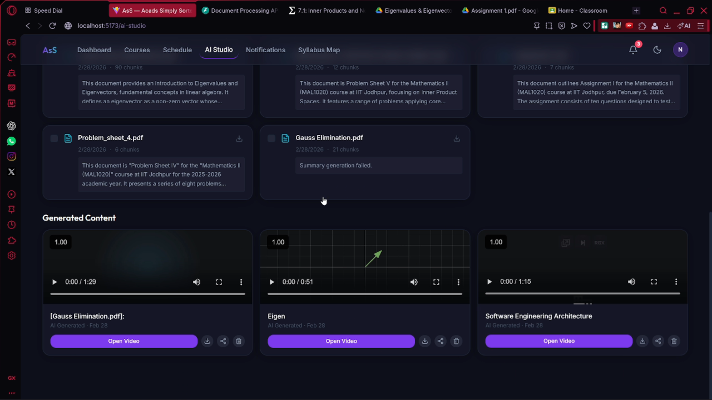
  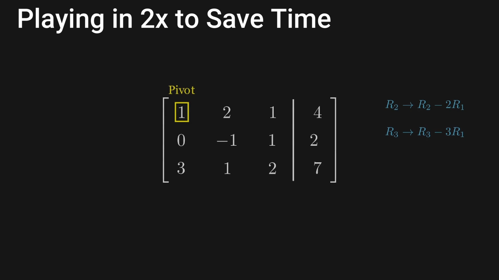
</p>

---

### Syllabus Mapper — Deep Search
> Vector-powered search across your entire course library. Find specific paragraphs, explanations, and concepts with relevance scoring.

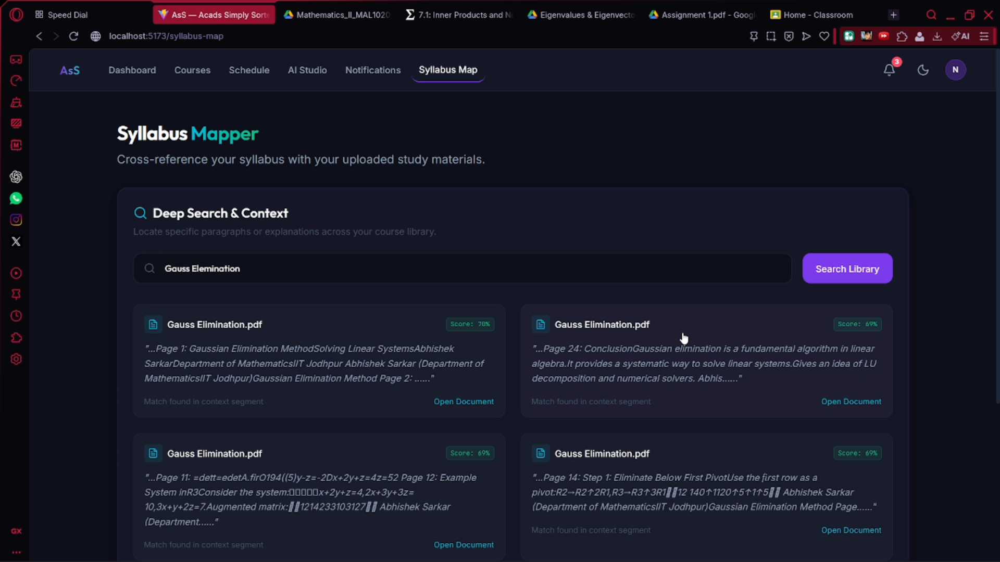

---

### Notifications — Urgency Escalation
> Smart notification system with escalating urgency (2 days → 1 hour before deadline) and configurable delivery channels.

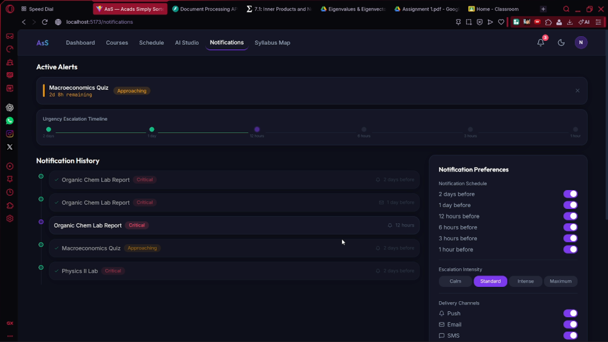

---

## 🏗️ Architecture

```
AsS-Acads-Simply-Sorted/
├── frontend/                   # React + Vite + TypeScript
│   ├── src/
│   │   ├── pages/
│   │   │   ├── Dashboard.tsx       # Stats, priority to-do, timeline
│   │   │   ├── Courses.tsx         # Google Classroom sync & course browser
│   │   │   ├── Schedule.tsx        # Dynamic weekly schedule generator
│   │   │   ├── AIStudio.tsx        # Video generation UI & pipeline
│   │   │   ├── Syllabus.tsx        # Deep search & context
│   │   │   ├── SyllabusMap.tsx     # Syllabus mapping interface
│   │   │   └── Notifications.tsx   # Alerts & preferences
│   │   ├── components/shared/      # Reusable UI components (Card, Button, etc.)
│   │   ├── context/AuthContext.tsx  # Google OAuth state management
│   │   └── services/api.ts         # Centralized API client
│   └── index.html
│
├── backend/                    # FastAPI + Python
│   └── app/
│       ├── main.py                 # API routes (auth, documents, classroom, search)
│       ├── database.py             # SQLite vector database (documents, chunks, embeddings)
│       ├── document_processor.py   # PDF/PPTX/DOCX text extraction + Gemini-powered summaries
│       ├── google_classroom_service.py  # Full Google Classroom API integration
│       ├── syllabus_mapper.py      # RAG-based syllabus ↔ material cross-referencing
│       ├── user_manager.py         # User state & preferences management
│       ├── config.py               # Paths, API keys, configuration
│       └── videoGen/               # Hybrid video generation engine
│           ├── router.py           # Video API routes + background generation pipeline
│           ├── video_agent.py      # AI scene planning (Manim + Remotion + fallback)
│           ├── grok_client.py      # Gemini API client wrapper
│           ├── tts_generator.py    # Text-to-speech narration (edge-tts)
│           └── output_manager.py   # Rendering, merging, and file management
│
└── images/                     # Application screenshots
```

### Data Flow

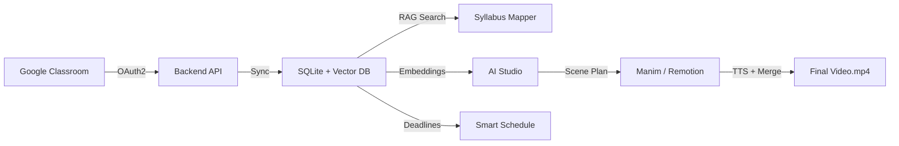

---

## 🛠️ Tech Stack

| Layer | Technology |
|---|---|
| **Frontend** | React 18, TypeScript, Vite, Lucide Icons |
| **Styling** | Custom CSS with design tokens (dark mode, glassmorphism) |
| **Backend** | FastAPI, Python 3.11+ |
| **Database** | SQLite (core data + vector embeddings) |
| **AI / LLM** | Google Gemini (text generation, summarization, scene planning) |
| **Video Engine** | ManimCE (math animations) + Remotion (motion graphics) — hybrid with auto-fallback |
| **TTS** | Edge-TTS (Microsoft neural voices) |
| **Auth** | Google OAuth 2.0 (JWT) |
| **Classroom** | Google Classroom API v1 |
| **Rendering** | FFmpeg (clip normalization + merging) |

---

## 🚀 Getting Started

### Prerequisites

- **Node.js** 18+ and **npm**
- **Python** 3.11+ and **pip**
- **FFmpeg** (for video rendering)
- **MiKTeX** or **TeX Live** (for Manim LaTeX rendering)
- Google Cloud project with Classroom API and OAuth 2.0 configured

### 1. Clone the repository

```bash
git clone https://github.com/nafees178/AsS-Acads-Simply-Sorted.git
cd AsS-Acads-Simply-Sorted
```

### 2. Backend Setup

```bash
cd backend
python -m venv .venv
.venv\Scripts\activate        # Windows
# source .venv/bin/activate   # Linux/Mac

pip install -r requirements.txt
```

Create a `.env` file in `backend/app/` with your API keys:

```env
GEMINI_API_KEY=your_gemini_api_key
GOOGLE_CLIENT_ID=your_google_oauth_client_id
GOOGLE_CLIENT_SECRET=your_google_oauth_client_secret
```

Start the backend:

```bash
python app/main.py
# Server runs at http://localhost:8000
```

### 3. Frontend Setup

```bash
cd frontend
npm install
npm run dev
# App runs at http://localhost:5173
```

### 4. Remotion Setup (for video generation)

```bash
cd backend/app/videoGen/my-video
npm install
```

---

## 🔑 Key Capabilities

### 🤖 AI-Powered Video Generation Pipeline
1. **Select source materials** — Pick PDFs from your vectorized library
2. **Auto-summarize** — Gemini extracts key concepts and generates a descriptive title
3. **Scene planning** — AI plans multi-scene educational content with narration scripts
4. **Hybrid rendering** — Manim for mathematical animations, Remotion for motion graphics, with automatic fallback
5. **TTS voiceover** — Neural text-to-speech narration overlaid on each scene
6. **Final merge** — FFmpeg normalizes and concatenates all clips into a polished video

### 📐 RAG-Powered Search
- Documents are chunked, embedded, and stored in a vector database
- Semantic search across your entire course library
- Cross-reference syllabus topics against uploaded materials with relevance scoring

### 📅 Intelligent Scheduling
- Fetches real deadlines from Google Classroom
- Sorts tasks by urgency and auto-allocates 1.5-hour study blocks
- Respects constraints: no study during class hours (weekdays 8AM–6PM) or sleep time (11PM–6AM)

---

## 📄 License

This project is part of an academic submission.

---

<p align="center">
  <strong>Built with ❤️ for students who want their academics <em>simply sorted</em>.</strong>
</p>
